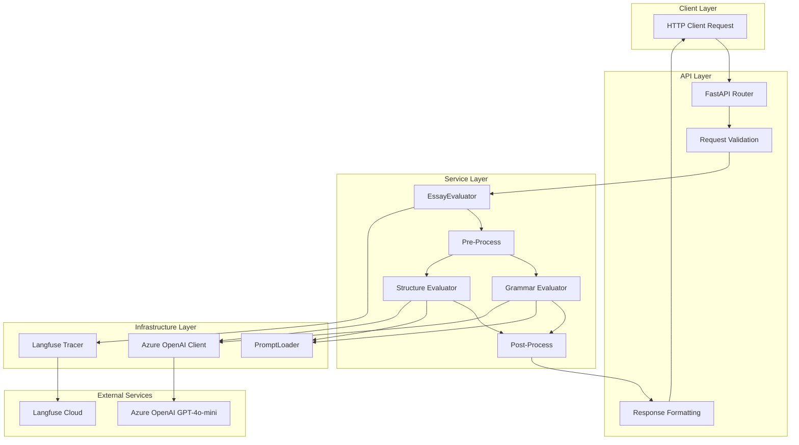

# AI Agent Engineer 채용 관련 과제 README

---

## 1. 프로젝트 개요
- AI 기반 Rubric 평가 자동화 서비스
- 평가 항목: Grammar, Introduction, Body, Conclusion
- 지원 레벨: Basic / Intermediate / Advanced / Expert
- Prompt Ops 기반 버전 관리 및 Langfuse Trace 기록

---

## 2. 실행 방법

### 로컬 실행
```bash
conda create -n essay-eval python=3.12
conda activate essay-eval
pip install -r requirements.txt
python main.py
````

→ Swagger UI: [http://localhost:8000/docs](http://localhost:8000/docs)

### Docker 실행

```bash
docker compose up --build
```

---

## 3. 환경 변수 설정

`.env` 파일 생성 (샘플: `.env.example` 참고)

```env
AZURE_OPENAI_ENDPOINT=https://<YOUR>.openai.azure.com/
AZURE_OPENAI_API_KEY=<YOUR_KEY>
AZURE_OPENAI_DEPLOYMENT=gpt-5-mini-<YOURNAME>
AZURE_OPENAI_API_VERSION=2024-12-01-preview

# 선택 (Langfuse)
LANGFUSE_PUBLIC_KEY=...
LANGFUSE_SECRET_KEY=...
LANGFUSE_HOST=https://cloud.langfuse.com
```

---

## 4. API 사용법

### 요청 예시

```http
POST /v1/essay-eval
Content-Type: application/json
```

```json
{
  "rubric_level": "Intermediate",
  "topic_prompt": "Describe your dream vacation.",
  "submit_text": "I want to go to..."
}
```

### 응답 예시

```json
{
  "level_group": "Intermediate",
  "grammar": { "score": 1 },
  "structure": { "introduction": { "score": 2 } },
  "aggregated": { "score": 1 },
  "timings": { "total": 1289.4 }
}
```

---

## 5. 프로젝트 구조

```bash
essay-eval/
├── app/
│   ├── api/v1/essay_eval.py     # API 라우터
│   ├── client/azure_openai.py   # Azure OpenAI 어댑터
│   ├── services/evaluation/     # 평가 로직 (pre/rubric/post)
│   ├── utils/                   # PromptLoader, Tracer
│   └── core/                    # 설정 및 상수
├── prompts/                     # Prompt 버전 관리
├── tests/                       # Unit/Integration 테스트
├── docker-compose.yml
├── pyproject.toml
└── .env.example
```

### 5.1 전체 시스템 국조



---

## 6. 평가 로직

1. Pre-Process: 언어/길이 검증
2. Rubric Chain: Introduction → Body → Conclusion (순차), Grammar (병렬)
3. Aggregation: 점수 합산 및 가중치 적용
4. Post-Evaluate: 레벨 그룹별 조건 반영
5. Trace 저장: Langfuse 기록

---

## 7. 참고 문서

* **성능 보고서 (내부 전용)**: [REPORT.md](./REPORT.md)
  → 점수 분포, 레벨별 난이도 분석, Prompt 버전별 성능 비교, 개선 제안 포함

---

## 8. 작성자

* 작성: 윤치영
* 포지션: AI Agent Engineer

